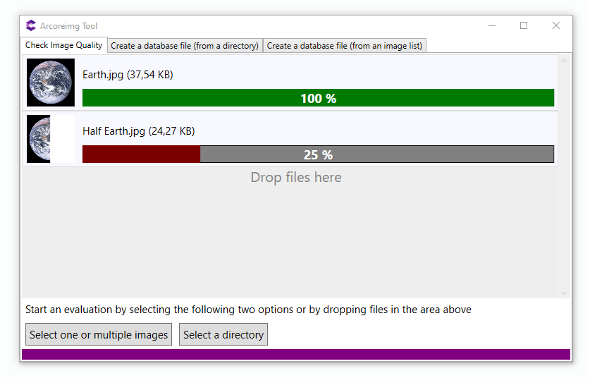

# arcoreimg Tool

A desktop app that implements arcoreimg

[arcoreimg](https://developers.google.com/ar/develop/c/augmented-images/arcoreimg)  is a command line tool that takes a set of reference images and generates an image database file. 

This tool is available in the [ARCore SDK for Android](https://github.com/google-ar/arcore-android-sdk/releases) and is for only Android and Android NDK developers. It is built into the Unity SDK and ARCore Unreal plugin. However if you dont like doing command line stuff when building an android app then this will do you good for Windows.

## Features

1. Check image quality
2. Create image database from a directory of images
3. Create a image database from an image list file

## Differences with JacksiroKe's version

A brief summary of the differences :
- Fixed an issue that would prevent evaluating images that have spaces in their path. 
- Fixed most encountered bugs for the image evaluation.
- Added the possibility to select multiple images instead of one for the image evaluation.
- Removed Dragablz, MahApps, ControlzEx, MaterialDesign, Windows.Interactivity dependencies.
- Because MaterialDesign was removed, the UI is less pretty, but still usable.

Overall this version should be easier to use and have less issues.

You can also check [the complete changelog here](CHANGELOG.md).